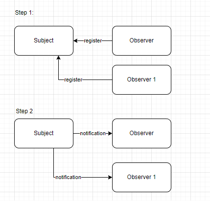

# Observer pattern
## Mục tiêu
Là một behavioral pattern, nó định nghĩa mối phụ thuộc 1 - n giữa các đối tượng. 
Để khi đối tượng 1 (subject) thay đổi trạng thái, tất cả thành phần phụ thuốc nó (observer) sẻ được thông báo và cập nhật một cách tự động
## Vấn đề giải quyết
_ Cho phép thay đổi Subject và Object một cách độc lập. Tái sử dụng subject mà không cần phụ thuộc vào Observer, (khi không cần có thể detach observer đi) => đảm bảo nguyên tắc Open/Closed Principle
_ Sự thay đổi trạng thái ở 1 đối tượng có thể được thông báo đén đối tượng khác mà không cần ràng buộc chặt chẻ.
## Sử dụng khi nào
* Quản lý sự kiện (Event management)
* Ứng dụng trong broadcast-type communication
* Khi thay đổi một đối tượng, yêu cầu thay đổi đối tượng khác mà chúng ta không biết có bao nhiêu đối tượng và đối tuượng đó là ai
## Áp dụng thực tế
1. Input là một bảng gồm nhiều trường các thông số (Subject)
2. Đối với các thông số đã cho ta có các trường dữ liệu dùng để vẻ biểu đồ (Observer)
3. Khi các trường subject thay đổi, sẻ gữi thông báo đến observer để các trường dữ liệu ở observer thay đổi tương ứng
