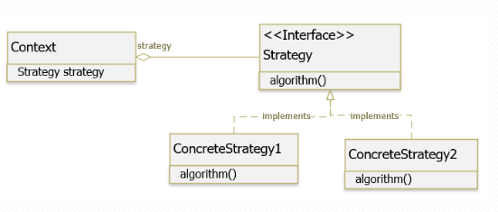

# Strategy pattern
## Mục tiêu
Là một behavioral pattern, giúp ta tách rời phần x lý một chức năng cụ thể ra khỏi 1 đối tượng. Nó cho phép định nghĩa tập hợp các thuật toán, đóng gói từng thuật toán lại để dễ dàng thay đổi các thuật toán bên trọng object.   
## Vấn đề giải quyết
* Cho phép ta tách rời 1 chức năng có nhiều thuật toán xử lý thay thế lẫn nhau. 
## Sử dụng khi nào
* Quản lý sự kiện (Event management)
* Ứng dụng trong broadcast-type communication
* Khi thay đổi một đối tượng, yêu cầu thay đổi đối tượng khác mà chúng ta không biết có bao nhiêu đối tượng và đối tuượng đó là ai
## Áp dụng thực tế
1. Input là một sản phẩm có nhiều loại giá (giá mặc định, giá preorder, giá áp dụng các promotion) (Strategy)
2. Đối với từng loại giá có cách tính khác nhau (algorithm())
3. Dựa vào các algorithm ta sẻ tính được giá thực tế của sản phẩm
   